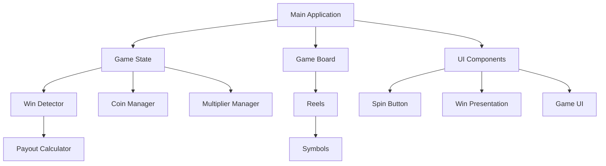

# Fruitful Fortune Slot Machine - Implementation Plan

This document provides detailed guidance and context for implementing the Fruitful Fortune slot machine game, complementing the task list with architectural decisions, implementation approaches, and technical considerations.

## Architecture Overview

The game will follow a component-based architecture with clear separation of concerns:

### Key Architectural Principles

1. **Separation of Concerns**: Each component should have a single responsibility
2. **Event-Driven Communication**: Components communicate via events rather than direct references
3. **State Management**: Centralized game state with controlled access
4. **Type Safety**: Leverage TypeScript for robust type checking
5. **Performance Optimization**: Efficient rendering with PixiJS

## Phase 1: Project Setup & Architecture

### Development Environment

The project is already set up with Vite, TypeScript, and ESLint. Key considerations:

- Vite provides fast refresh capabilities, which will be valuable for rapid UI development
- TypeScript configuration should be strict to ensure type safety
- ESLint rules should enforce consistent code style and prevent common errors
- Asset handling in Vite should be configured for efficient loading of images and audio

### Folder Structure Rationale

The proposed folder structure follows a logical separation of concerns:

- `components/`: Visual elements rendered with PixiJS
- `core/`: Game logic and mechanics
- `types/`: TypeScript interfaces and type definitions
- `utils/`: Helper functions and utilities
- `assets/`: Asset management and loading
- `state/`: Game state management
- `tests/`: Unit tests

This structure allows for clear organization and makes it easier to locate and modify specific parts of the codebase.

## Phase 2: Core Game Components

### Symbol System Design

The symbol system is a fundamental part of the slot machine. Each symbol should have:

- **Name**: Identifier for the symbol
- **Icon**: Visual representation
- **Payout Value**: Base value for winning combinations
- **Rarity Weight**: Determines how frequently the symbol appears

The 7 symbols should be implemented with a rarity distribution where Seven is the rarest and Cherry is the most common. This can be achieved using a weighted random selection algorithm.

### Reel System Implementation

The reel system should be implemented as a container of symbols with the following features:

- **Spinning Animation**: Smooth animation with variable speed
- **Symbol Placement**: Proper positioning of symbols within the reel
- **Stopping Logic**: Realistic stopping behavior with proper timing and easing

Each reel should operate independently but be synchronized for the overall game experience.

### Game Board Layout

The game board should be a 3x5 grid (3 rows, 5 columns) with the following considerations:

- **Responsive Layout**: Adjust to different screen sizes
- **Symbol Positioning**: Clear visual separation between symbols
- **Win Line Visualization**: Ability to highlight winning combinations

## Phase 3: Game Logic Implementation

### Winning Combinations

The game should detect the following winning combinations:

1. **3 Across**: Three matching symbols in a horizontal line
2. **3 Down**: Three matching symbols in a vertical line
3. **3 Diagonal**: Three matching symbols in a diagonal line
4. **4 Across**: Four matching symbols in a horizontal line
5. **5 Across**: Five matching symbols in a horizontal line
6. **5 Mirrored Diagonal**: Five matching symbols in a mirrored diagonal pattern
7. **9 Square**: Nine matching symbols forming a 3x3 square
8. **15 All Match Jackpot**: All 15 symbols match (full board)

Each combination should have a visual representation and a corresponding payout value.

### Payout System

The payout system should calculate winnings based on:

- **Base Symbol Value**: Each symbol has a different value
- **Combination Type**: Different combinations have different multipliers
- **Current Multiplier**: The game's current multiplier state

The payout calculation should be transparent and consistent.

### Coin System

Players start with a set number of coins. The coin system should:

- **Track Balance**: Keep track of the player's current coin balance
- **Deduct for Spins**: Each spin costs 1 coin
- **Add Winnings**: Add coins based on winning combinations
- **Persist State**: Save the coin balance between sessions

### Multiplier System

The multiplier system increases payouts based on winning combinations:

- **Starting Multiplier**: 1x for basic wins (3 across/3 down)
- **Increased Multipliers**: Higher multipliers for more complex combinations (e.g., 5 across = 2x, Jackpot = 5x)
- **Multiplier Progression**: Rules for when multipliers increase or reset

## Phase 4: UI Components

### Main Game UI

The main UI should include:

- **Coin Balance Display**: Clear visualization of remaining coins
- **Multiplier Display**: Current multiplier value
- **Win Amount Display**: Amount won in the current spin
- **Game Header/Footer**: Title, branding, and additional information

### Spin Button

The spin button is the primary interaction point:

- **Visual States**: Normal, hover, pressed, disabled
- **Animation**: Spinning animation during reel spin
- **Interaction**: Mouse click, touch, and keyboard (spacebar) support

### Win Presentation

Winning should be celebrated with appropriate visual and audio feedback:

- **Win Animations**: Different animations based on win size
- **Particle Effects**: Special effects for big wins
- **Counter Animation**: Animated counting of win amount
- **Jackpot Celebration**: Special sequence for jackpot wins

## Phase 5: Visual and Audio Implementation

### Symbol Artwork

High-quality artwork for all 7 symbols is essential:

- **Consistent Style**: All symbols should share a cohesive visual style
- **Clear Differentiation**: Each symbol should be easily distinguishable
- **Animation States**: Normal, spinning, and winning states
- **Optimization**: Proper texture optimization for performance

### Animation Effects

Animations add life to the game:

- **Reel Spinning**: Smooth spinning animation with proper physics
- **Win Lines**: Animated highlighting of winning combinations
- **Celebration Effects**: Particle effects, flashes, and other visual feedback
- **Ambient Animations**: Subtle animations during idle state

### Sound Design

Sound effects enhance the gaming experience:

- **Reel Sounds**: Spinning and stopping sounds
- **Win Sounds**: Different sounds based on win size
- **UI Sounds**: Button clicks and other interface interactions
- **Background Music**: Ambient music that fits the theme
- **Volume Control**: Ability to adjust or mute sound

## Phase 6: Integration and Testing

### Component Integration

All components should be integrated into a cohesive whole:

- **Initialization Sequence**: Proper loading and setup of all components
- **Event System**: Communication between components via events
- **Resource Management**: Proper loading and unloading of resources
- **Error Handling**: Graceful handling of errors and edge cases

### Testing Strategy

Comprehensive testing ensures a robust game:

- **Unit Tests**: Test individual components and functions
- **Integration Tests**: Test interactions between components
- **Performance Tests**: Ensure smooth performance under various conditions
- **Cross-Browser Testing**: Verify functionality across different browsers

## Phase 7: Polishing and Deployment

### Code Quality

High-quality code ensures maintainability:

- **Consistent Style**: Follow established coding conventions
- **Documentation**: Clear comments and documentation
- **Refactoring**: Eliminate code smells and improve structure
- **Optimization**: Improve performance and reduce resource usage

### Final Polish

The final polish phase adds the finishing touches:

- **Visual Effects**: Additional visual effects for a polished look
- **Transitions**: Smooth transitions between game states
- **Edge Cases**: Handle all possible edge cases gracefully
- **User Experience**: Ensure a smooth and enjoyable user experience

### Deployment

Proper deployment ensures the game is accessible:

- **Build Optimization**: Minimize file sizes and optimize loading
- **Asset Compression**: Compress images and audio for faster loading
- **Caching Strategy**: Implement proper caching for assets
- **Analytics**: Add analytics to track user engagement

## Technical Considerations

### PixiJS Best Practices

- Use sprite batching for improved performance
- Implement proper texture management to reduce memory usage
- Use the PixiJS ticker for consistent animation timing
- Implement proper cleanup to prevent memory leaks

### TypeScript Type Safety

- Define interfaces for all game objects
- Use strict type checking to catch errors early
- Leverage generics for reusable components
- Document types with JSDoc comments

### Performance Optimization

- Minimize DOM operations
- Use object pooling for frequently created/destroyed objects
- Implement proper asset loading and unloading
- Profile and optimize render loop performance

### Mobile Considerations

- Implement responsive design for different screen sizes
- Optimize touch controls for mobile devices
- Consider battery usage and optimize accordingly
- Test on various mobile devices and browsers

## Future Enhancements

The PRD outlines several potential future enhancements:

- **Bonus Rounds**: Special gameplay modes with unique mechanics
- **Different Themes**: Alternative visual themes for variety
- **Progressive Jackpots**: Accumulating jackpot system
- **Enhanced UI**: More detailed UI with additional features

These enhancements should be considered during the initial implementation to ensure the architecture can accommodate them without major refactoring.
